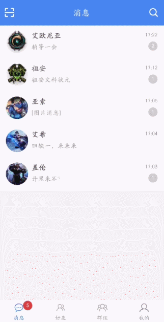

## EasyChat

EasyChat for Android 是一个开源的社交类的App。主要包含消息、好友、群组等相关的社交核心功能。部分界面参照了QQ、微信等相关社交APP。更多精彩详情，请[下载App](https://raw.githubusercontent.com/yetel/EasyChatAndroidClient/master/app/release/app-release.apk)体验吧。

#####   App主要采用MVVM基于 [MVVMFrame](https://github.com/jenly1314/MVVMFrame) 框架搭建。

### 核心技术点

* JectPack(Lifecycle，LiveData，ViewModel，Room)
* Dagger
* DataBinding
* Netty
* Kotlin Coroutines

### EasyChat相关开源项目

##### 服务端：[EasyChatServer](https://github.com/yetel/EasyChatServer)
##### Java客户端：[EasyChatJavaClient](https://github.com/yetel/EasyChatJavaClient)

## Gif 展示

###### 录制的gif效果有点不清晰，可以下载App查看详情。

## 下载

####    扫描二维码下载

####    下载地址：https://fir.im/EasyChatAndroid

## 版本记录

#### 2019-10-31    v1.0.0    初始版本
*  EasyChat完成主要核心功能

## 鸣谢

感谢所有开源库的开发者和开源精神。
